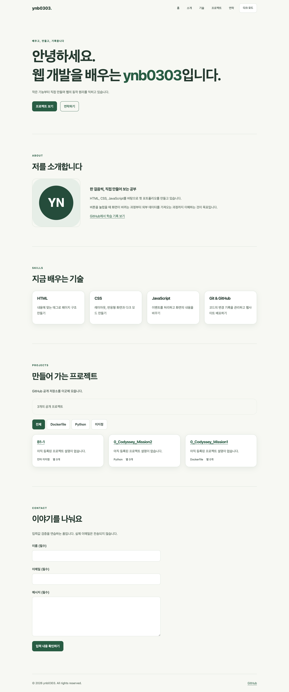
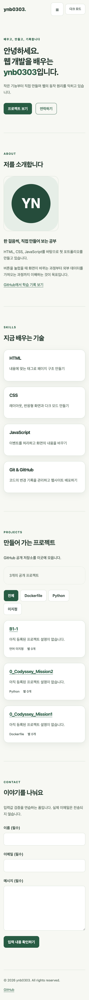
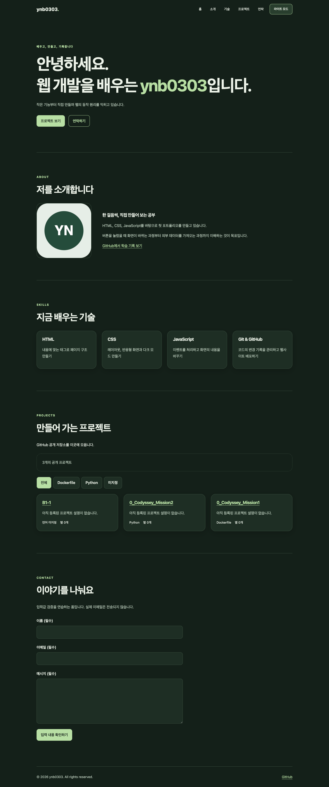

# B1-1 | ynb0303의 포트폴리오

HTML, CSS, JavaScript만으로 만든 반응형 학습 포트폴리오입니다. 사용자의 행동이 상태를 바꾸고, 바뀐 상태가 화면에 반영되는 흐름을 연습합니다.

## 진행 상황
- HTML/CSS와 JavaScript 기능 구현 완료, 로컬 Chrome 브라우저 검증 통과
- GitHub Pages 배포 전 (배포 URL은 아직 없습니다)
- 저장소 URL: https://github.com/ynb0303/B1-1
- 사용 기술: HTML5, CSS3, 순수 JavaScript, GitHub REST API
- 외부 런타임 라이브러리 및 프레임워크 없음

## 실행 방법
1. VS Code에서 이 폴더를 엽니다.
2. Live Server 확장을 설치합니다.
3. index.html을 오른쪽 클릭하고 Open with Live Server를 선택합니다.
4. 열린 브라우저에서 확인합니다. 파일을 저장하면 화면이 갱신됩니다.

## 파일 구성
- index.html: 시맨틱 구조, 여섯 개 섹션, 폼
- css/style.css: 모바일 기본 스타일, 반응형, 테마 변수
- js/main.js: 상태, 이벤트, 렌더링, API, 폼 검증
- images/profile.svg: 직접 작성한 임시 이니셜 프로필
- MISSION-CHECKLIST.md: 요구사항별 확인 목록
- EXPLANATION-GUIDE.md: 코드 학습과 발표 가이드

## 주요 기능
- Hero, About, Skills, Projects, Contact, Footer
- 모바일 메뉴 열기/닫기, Escape 및 외부 클릭으로 닫기
- 앵커 부드러운 스크롤, 맨 위로 버튼, 스크롤 시 헤더 배경 변경
- 다크 모드 전환 및 localStorage 저장
- 저장된 테마가 없으면 시스템 테마 감지 (선택 보너스)
- Intersection Observer 등장 애니메이션
- 이름·이메일·메시지 검증 및 필드별 오류 메시지
- 본인 GitHub 공개 저장소 카드, 언어별 필터 (선택 보너스)
- API 로딩·성공·에러·빈 상태, 실패 시 재시도

문의 폼은 입력 검증 연습용입니다. 성공 메시지는 검증 성공을 의미하며 실제 이메일을 전송하지 않습니다. 프로필과 자기소개는 제출 전 본인의 내용으로 검토해 주세요.

## 구현 기준
- 모바일 우선, 태블릿 768px 이상, 데스크톱 1024px 이상
- 내비게이션: Flexbox / 프로젝트 카드: Grid의 auto-fit, minmax
- 스크롤 60px 이상: 헤더 배경 변경
- 스크롤 300px 이상: 맨 위로 버튼 표시
- Intersection Observer threshold: 0.2 (관찰 요소의 20%)
- 긴 섹션 대신 제목·프로필·기술 카드를 관찰하여 모바일에서도 등장
- 움직임 최소화 설정에서는 부드러운 스크롤과 애니메이션 생략
- 테마 저장 키: portfolio-theme. 브라우저가 저장을 차단하면 현재 화면에서만 적용

## GitHub API
`https://api.github.com/users/ynb0303/repos?sort=updated&per_page=100&page=1`

fetch와 async/await로 공개 저장소를 가져옵니다. 다음 페이지가 있으면 Link 헤더를 확인하여 추가 요청합니다. 비공개 저장소는 표시하지 않습니다. 403/429와 기타 HTTP 오류, 네트워크 실패, 15초 시간 초과를 처리합니다. 인증 없는 요청은 일반적으로 시간당 60회 제한이 있으므로 반복 새로고침에 주의합니다. API 데이터를 innerHTML로 표시하기 전에 특수문자를 이스케이프합니다.

## 상태 → 렌더링
| 사용자 행동/작업 | 변경 상태 | 화면 갱신 함수 |
| --- | --- | --- |
| 테마 클릭 | state.theme | renderTheme |
| 메뉴 클릭 | state.menuOpen | renderMenu |
| API 요청/완료 | state.projects.status, items, error | renderProjects |
| 언어 필터 클릭 | state.projects.language | renderProjects |
| 폼 입력/제출 | state.form.values, errors, success | renderForm |

## 배포 및 스크린샷
아래 이미지는 **로컬 서버에서 실제 GitHub API를 연결해 촬영한 화면**입니다. 배포 사이트에서 촬영한 결과는 아닙니다.

### 데스크톱 (1440px)


### 모바일 (390px)


### 다크 모드 (1440px)


## 검증 결과
2026-09-05, 설치된 Google Chrome의 헤드리스 모드에서 Playwright로 검증했습니다. 테스트 도구는 개발용이며 웹사이트에 외부 라이브러리를 추가하지 않습니다.

- 320/390/768/1024/1440px에서 가로 넘침 없음
- 모바일 메뉴 열기·닫기, Escape, 메뉴 링크 이동 및 초점 이동
- 다크 모드 전환과 새로고침 후 테마 유지
- 스크롤 헤더 변경 및 맨 위로 이동
- 공백·필수값·이메일 형식 오류, 입력 수정, 정상 제출
- 모의 API 응답으로 로딩·성공·빈 목록·403 오류·네트워크 실패·재시도 확인
- 언어 필터와 전체 목록 복원, 외부 HTML 문자열 이스케이프
- 실제 GitHub API로 공개 저장소 3개 표시 (검증 당시)
- 실제 스크롤에 따른 Intersection Observer 등장과 스크린샷 3종 생성
- 검증 중 JavaScript 실행 오류 없음

테스트 코드: [tests/browser_check.py](tests/browser_check.py), 결과: [tests/results.json](tests/results.json).

재실행하려면 개발용 Python 가상환경에 playwright를 설치하고 Google Chrome이 있는 상태에서 실행합니다. 아래 명령은 macOS 기준입니다.

```sh
python3 -m venv /tmp/portfolio-browser-env
/tmp/portfolio-browser-env/bin/pip install playwright
python3 -m http.server 8765 --bind 127.0.0.1
```

위 서버를 켜 둔 채 다른 터미널에서:

```sh
/tmp/portfolio-browser-env/bin/python tests/browser_check.py
```

자동 검증은 모든 브라우저·보조 기술을 보장하지 않습니다. 15초 시간 초과, 여러 페이지의 저장소, 시스템 테마 실시간 변경은 코드로 구현했지만 별도 자동 시나리오로 검증하지 않았습니다.

## GitHub Pages 배포하기 — 아직 남은 작업
GitHub 계정 인증을 완료하고 기존 `ynb0303/B1-1` 저장소의 main 브랜치에 연결했습니다. 아래는 직접 배포 과정을 설명하거나 다시 설정할 때 참고할 절차입니다.

1. VS Code 왼쪽 **소스 제어**를 엽니다.
2. 커밋 작성자 설정 안내가 나오면 본인의 이름과 GitHub에서 사용하는 이메일을 설정합니다. 터미널에서 설정할 때는 아래 예시를 본인의 값으로 바꾸세요. 전역 설정이 아닌 이 저장소에만 적용됩니다.

   ```sh
   git config user.name "본인 이름"
   git config user.email "본인 GitHub 이메일"
   ```

3. 변경 파일을 스테이징(+)하고 `포트폴리오 첫 구현`처럼 메시지를 입력해 커밋합니다. 커밋은 현재 코드의 저장 기록입니다.
4. **브랜치 게시 / Publish Branch / Publish to GitHub**를 선택하고 GitHub에 로그인합니다. 이 프로젝트는 기존 공개 저장소 `B1-1`을 사용합니다. 같은 이름이 이미 있다면 다른 이름을 사용하고 아래 URL의 저장소 이름도 바꾸세요.
5. GitHub 저장소의 **Settings → Pages → Build and deployment**로 이동합니다.
6. Source를 **Deploy from a branch**, 브랜치를 **main**, 폴더를 **/(root)**로 선택하고 저장합니다.
7. 배포가 끝나면 Pages에 표시된 **Visit site** 주소를 엽니다.
8. 배포된 화면에서 메뉴·테마 유지·스크롤·API·폼·모바일 레이아웃을 다시 확인합니다.
9. README 상단에 실제 저장소 URL과 배포 URL을 기록하고 변경 사항을 커밋·동기화합니다.

이 저장소의 Pages 예상 주소는 `https://ynb0303.github.io/B1-1/`입니다. **현재 배포가 확인된 주소가 아닙니다.** 파일 경로는 상대 경로로 작성해 저장소 하위 경로에서도 CSS·JS·이미지를 읽도록 했습니다. `.nojekyll`은 정적 파일을 그대로 제공하기 위한 설정입니다.

## 최종 제출물
- 실제 GitHub 저장소 URL
- 접속 확인을 마친 GitHub Pages URL
- 데스크톱·모바일·다크 모드 스크린샷 (배포 후에도 화면이 같은지 확인)
- 프로젝트 설명·기술·실제 배포 URL·스크린샷이 담긴 README

## 참고 문서
- [GitHub Pages 사이트 만들기](https://docs.github.com/en/pages/getting-started-with-github-pages/creating-a-github-pages-site)
- [GitHub Pages 배포 소스 설정](https://docs.github.com/en/pages/getting-started-with-github-pages/configuring-a-publishing-source-for-your-github-pages-site)
- [사용자의 공개 저장소 목록 API](https://docs.github.com/en/rest/repos/repos#list-repositories-for-a-user)

